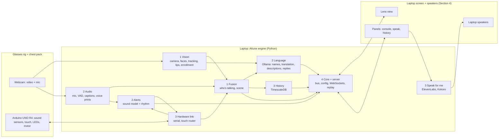

# Attune feature map

This map shows what Attune does, which section builds each part, and which files each part lives in. Four people (and their agents) build in parallel, each in their own section's folders. The sections connect only through the events in [contracts.md](contracts.md).

- Full design: [attune-build-plan.html](attune-build-plan.html) (download it and open it in a browser)
- Rules for agents: [../AGENTS.md](../AGENTS.md)
- Checklist: [../TODO.md](../TODO.md)

## How it fits together



## The four sections

| # | Section | Owns (folders) | Main features | Owner |
|---|---|---|---|---|
| 1 | **Vision** | `engine/attune/vision/`, `engine/attune/fusion/`, `tests/vision/` | Camera, face finding, tracking, face naming, enrollment (face), lip motion, who's talking, instant colour labels | _name_ |
| 2 | **Audio & Language** | `engine/attune/audio/`, `alerts/`, `llm/`, `calibration/`, `tests/audio_language/`, `docs/calibration.md`, `scripts/make_test_tones.py` | Mic, voice activity, captions, voice prints, sound alerts, name learning, translation, garment descriptions, suggested replies, calibration | _name_ |
| 3 | **Hardware & Services** | `firmware/`, `engine/attune/hardware/`, `speech_out/`, `history/`, `tests/hardware_services/`, `docs/hardware/` | The rig, Arduino firmware, serial link, touch rules, ElevenLabs "speak for me" with Kokoro fallback, Tiger Data history | _name_ |
| 4 | **Pages, Engine & Demo** | `engine/attune/core/`, `server/`, `replay/`, `main.py`, `config.py`, `web/`, `scripts/` (except test tones), `tests/pages_engine/`, `docs/setup.md`, `docs/demo-script.md` | Bus, contracts code, config, web server, lens view, console/speak/history panels, keyboard, status, replay, setup, OBS, demo and write-up | _name_ |

**Shared files** (change only in small `[shared]` PRs): `docs/contracts.md`, `engine/attune/core/contracts.py`, `engine/pyproject.toml`, `config/attune.example.toml`, `.env.example`, `.gitignore`, `README.md`, `AGENTS.md`, `CLAUDE.md`, `docs/feature-map.md`. `TODO.md` is shared too, but each person only ticks lines in their own section.

## Features, by section

Each feature lists its TODO IDs, the gate it's needed by, and what it depends on. Gates come from the plan's 24-hour schedule: **M0** (H3) devices stream in, **M1** (H8) captions on named faces, **M2** (H14) every feature works alone, **M3** (H18) full demo / feature freeze, **M4** (H22) three clean rehearsals.

### Section 1 – Vision
| Feature | TODO | Gate | Needs from others | Gives to others |
|---|---|---|---|---|
| Camera capture | V-01, V-02 | M0 | core.clock, bus (4) | `vision.frame` |
| Find, track and name faces | V-03 – V-06 | M1 | — | `vision.tracks`, `vision.track_lost` |
| Enrollment with consent (face part) | V-07 | M1 | `enroll.start` command (4); voice part (2) | `enroll.result`, `person.changed` |
| Lip motion | V-08 | M1 | — | lip scores in `vision.tracks` |
| Who's talking + scene | V-09, V-10 | M1 / M2 | `audio.transcript`, `audio.vad`, `audio.voice_match` (2); `sensors.levels` (3) | `caption`, `scene` |
| Voice-print harvesting | V-11 | M2 | voice prints (2) | `voice.harvest` |
| Instant colour labels | V-12 | M2 | — | `vision.appearance` |

### Section 2 – Audio & Language
| Feature | TODO | Gate | Needs from others | Gives to others |
|---|---|---|---|---|
| Microphone | A-01 | M0 | core.clock, ringbuffer (4) | audio blocks |
| Voice activity + captions | A-02 – A-05 | M1 | `speech_out.playing` (3) | `audio.vad`, `audio.transcript` |
| Voice prints | A-06 | M2 | `voice.harvest` (1) | `audio.voice_match` |
| Sound alerts | A-08 – A-10 | M2 | `sensors.levels` (3) | `alert`, `hw.pattern` |
| Ollama jobs: names, translation, descriptions, replies | A-07, A-11 – A-15 | M2 | `caption` (1), `vision.appearance` (1), `touch.action` (3) | `name.proposal`, `caption.translation`, `vision.description`, `reply.suggestions` |
| Calibration + test tones | A-16, A-17 | M3 | levels (3), faces (1), console UI (4) | venue profile |

### Section 3 – Hardware & Services
| Feature | TODO | Gate | Needs from others | Gives to others |
|---|---|---|---|---|
| Firmware: levels, touch, patterns, safety | H-01 – H-04 | M0 / M2 | — | serial lines |
| Serial link | H-05 | M0 | bus (4) | `sensors.levels`, `sensors.touch`, `hw.link` |
| Touch router | H-06 | M2 | `alert`, `name.proposal` (2) | `touch.action` |
| Speak for me (ElevenLabs + Kokoro) | H-07 – H-09 | M2 | `speak` command (4) | `speech_out.playing`, `reply.spoken` |
| Conversation history (Tiger Data) | H-10 – H-12 | M1 / M2 | `caption`, `caption.translation` (1, 2), `alert` (2) | history API |
| Rig assembly + bench tests | H-13 | M0 – M2 | — | the physical rig |

### Section 4 – Pages, Engine & Demo
| Feature | TODO | Gate | Needs from others | Gives to others |
|---|---|---|---|---|
| Contracts code, bus, clock, config, main | P-01, P-02 | M0 | — | everything others plug into |
| Web server + WebSockets + commands | P-03, P-04 | M0 | events from 1–3 | `command` |
| Status | P-05 | M0 | `status.part` from all | status strip |
| Lens view: video, tags, bubbles, alerts | P-06 – P-08 | M0 – M2 | `scene`, `caption`, `alert`, `name.proposal` | the demo screen |
| Panels: console, speak, history + keys | P-09 – P-12 | M1 – M2 | history API (3), `reply.suggestions` (2) | commands |
| Session log + replay | P-13 | M1 | frames, audio, serial | test reels for everyone |
| Setup, scripts, OBS, demo, write-up | P-14, P-15 | M3 – M4 | — | submission |

## File map

Every file below already exists with a header that says what goes in it. Build inside those files; if you need a new file, add it inside your own section's folder.

### Section 1 - Vision

| File | What it is | TODO |
|---|---|---|
| `engine/attune/vision/__init__.py` | Vision package | V-02 |
| `engine/attune/vision/service.py` | VisionService: camera -> detect -> track -> name -> lips | V-02 |
| `engine/attune/vision/camera.py` | Webcam reader | V-01 |
| `engine/attune/vision/detector.py` | Face finder (InsightFace SCRFD-10G, ONNX Runtime GPU) | V-03 |
| `engine/attune/vision/tracker.py` | Face tracker (ByteTrack style) | V-04 |
| `engine/attune/vision/embedder.py` | Face prints (ArcFace w600k_r50 from buffalo_l) | V-05 |
| `engine/attune/vision/gallery.py` | Enrolled faces and the match rules | V-06 |
| `engine/attune/vision/enrollment.py` | Face side of enrollment, with consent | V-07 |
| `engine/attune/vision/mouth.py` | Lip-motion score per face (MediaPipe Face Landmarker on crops) | V-08 |
| `engine/attune/vision/appearance.py` | Instant colour label for strangers | V-12 |
| `engine/attune/fusion/__init__.py` | Who's-talking fusion package | V-09 |
| `engine/attune/fusion/speaker.py` | Decides who is talking and builds the Scene | V-09 |
| `engine/attune/fusion/sync.py` | In-time check: do the lips move with the sound? | V-10 |
| `engine/attune/fusion/harvest.py` | Voice-print harvesting for this session | V-11 |

### Section 2 - Audio & Language

| File | What it is | TODO |
|---|---|---|
| `engine/attune/audio/__init__.py` | Audio package | A-01 |
| `engine/attune/audio/service.py` | AudioService: mic -> VAD -> captions -> voice prints | A-05 |
| `engine/attune/audio/mic.py` | Microphone reader | A-01 |
| `engine/attune/audio/vad.py` | Voice activity (Silero VAD v6) | A-02 |
| `engine/attune/audio/asr.py` | Captions: Nemotron 3.5 streaming via sherpa-onnx (INT8) | A-03 |
| `engine/attune/audio/asr_whisper.py` | Fallback captions: faster-whisper large-v3-turbo | A-04 |
| `engine/attune/audio/voiceprint.py` | Voice prints (CAM++ via sherpa-onnx) | A-06 |
| `engine/attune/audio/language_id.py` | Text language check (Lingua) | A-07 |
| `engine/attune/alerts/__init__.py` | Sound alerts package | A-08 |
| `engine/attune/alerts/service.py` | AlertService: model + rhythm -> one decision | A-10 |
| `engine/attune/alerts/sound_model.py` | EfficientAT mn10_as scorer | A-08 |
| `engine/attune/alerts/rhythm.py` | T3 / T4 rhythm detector | A-09 |
| `engine/attune/alerts/rules.py` | Alert rules, direction, acknowledge and clear | A-10 |
| `engine/attune/llm/__init__.py` | Ollama language jobs package | A-11 |
| `engine/attune/llm/client.py` | Ollama client with a priority queue | A-11 |
| `engine/attune/llm/names.py` | Learning names from introductions | A-12 |
| `engine/attune/llm/translate.py` | Translation of non-English finals | A-13 |
| `engine/attune/llm/describe.py` | Garment descriptions for strangers | A-14 |
| `engine/attune/llm/replies.py` | Three suggested replies for keys 7-9 | A-15 |
| `engine/attune/llm/data/name_stoplist.txt` | Words that are never names (~200) | A-12 |
| `engine/attune/calibration/__init__.py` | Calibration package | A-16 |
| `engine/attune/calibration/wizard.py` | The 10-minute venue calibration steps | A-16 |
| `engine/attune/calibration/profile.py` | Venue profile save/load | A-16 |
| `scripts/make_test_tones.py` | Generates T3 / T4 alarm tones for tests | A-17 |
| `docs/calibration.md` | How to run venue calibration | A-16 |

### Section 3 - Hardware & Services

| File | What it is | TODO |
|---|---|---|
| `engine/attune/hardware/__init__.py` | Arduino link package | H-05 |
| `engine/attune/hardware/serial_link.py` | USB serial link to the Arduino | H-05 |
| `engine/attune/hardware/protocol.py` | Parse and format the serial text lines | H-05 |
| `engine/attune/hardware/touch_router.py` | Decides what a tap or hold means right now | H-06 |
| `engine/attune/speech_out/__init__.py` | Speak-for-me package | H-09 |
| `engine/attune/speech_out/service.py` | SpeechOutService: speak a typed reply | H-09 |
| `engine/attune/speech_out/elevenlabs_tts.py` | ElevenLabs low-latency streaming voice | H-07 |
| `engine/attune/speech_out/kokoro_tts.py` | Offline voice: Kokoro-82M via sherpa-onnx | H-08 |
| `engine/attune/speech_out/player.py` | Plays audio on the laptop speakers | H-09 |
| `engine/attune/history/__init__.py` | Conversation history package (Tiger Data) | H-10 |
| `engine/attune/history/schema.sql` | TimescaleDB schema | H-10 |
| `engine/attune/history/db.py` | Connection and writes | H-11 |
| `engine/attune/history/service.py` | HistoryService: saves every final caption, translation, reply, alert and confirmed name | H-11 |
| `engine/attune/history/queries.py` | Reads for the history panel | H-12 |
| `engine/attune/history/api.py` | FastAPI router for the history panel (/api/history/...) | H-12 |
| `firmware/README.md` | Firmware for the Arduino UNO R4 WiFi | H-01 |
| `firmware/attune_rig/attune_rig.ino` | Main sketch | H-01, H-02, H-03, H-04 |
| `firmware/attune_rig/protocol.h` | Serial message names shared with hardware/protocol.py | H-01 |
| `firmware/attune_rig/patterns.h` | Light and buzz pattern timings (T3, T4, BELL, NAME, OK, NO, LOST) | H-03 |
| `docs/hardware/wiring.md` | Rig wiring and bench-test log | H-13 |

### Section 4 - Pages, Engine & Demo

| File | What it is | TODO |
|---|---|---|
| `engine/attune/__init__.py` | Attune engine package | P-02 |
| `engine/attune/__main__.py` | Entry point for `uv run python -m attune` | P-02 |
| `engine/attune/main.py` | Starts and stops every service | P-02 |
| `engine/attune/config.py` | Loads config/attune.toml (copied from attune.example.toml) | P-02 |
| `engine/attune/core/__init__.py` | Shared engine plumbing | P-01 |
| `engine/attune/core/contracts.py` | Event and message types - the code copy of docs/contracts.md | P-01 |
| `engine/attune/core/bus.py` | In-process publish/subscribe bus | P-02 |
| `engine/attune/core/clock.py` | One clock for audio, video and sensor timestamps | P-02 |
| `engine/attune/core/ringbuffer.py` | Last 30 s of audio and 5 s of frames | P-02 |
| `engine/attune/core/status.py` | Collects status.part events into one status message per second | P-05 |
| `engine/attune/core/session_log.py` | Timestamped log of every bus event for the session | P-13 |
| `engine/attune/server/__init__.py` | Web server package | P-03 |
| `engine/attune/server/app.py` | FastAPI app: serves web/ and mounts routers | P-03 |
| `engine/attune/server/ws.py` | WebSocket hub for the pages | P-03 |
| `engine/attune/server/commands.py` | Turns page commands into bus events | P-04 |
| `engine/attune/replay/__init__.py` | Record and replay sessions | P-13 |
| `engine/attune/replay/recorder.py` | Records the rehearsal reel | P-13 |
| `engine/attune/replay/player.py` | Feeds a recorded reel instead of live devices | P-13 |
| `web/lens/index.html` | Lens view (full screen, recorded by OBS) | P-06 |
| `web/lens/lens.js` | Draws frames, face tags and the status strip | P-06 |
| `web/lens/bubbles.js` | Speech bubbles | P-07 |
| `web/lens/alerts.js` | Alert banners, name proposals and the paused state | P-08 |
| `web/lens/lens.css` | Lens view styles (the films' HUD look) | P-06 |
| `web/panels/console.js` | Console panel (C) | P-09 |
| `web/panels/speak.js` | Speak panel (S) | P-10 |
| `web/panels/history.js` | History panel (Y) | P-11 |
| `web/panels/panels.css` | Slide-over panel styles | P-09 |
| `web/shared/ws.js` | WebSocket client with auto-reconnect | P-03 |
| `web/shared/keys.js` | Keyboard shortcuts | P-12 |
| `web/shared/theme.css` | Colours and type shared by every page | P-06 |
| `scripts/check_setup.py` | Checks GPU, CUDA libraries, models, Ollama, PostgreSQL and devices | P-14 |
| `scripts/download_models.py` | Fetches the model list in docs/setup.md into models/ | P-14 |
| `scripts/start_attune.ps1` | Starts the engine and restarts it if it dies | P-14 |
| `docs/setup.md` | Install and setup guide | P-14 |
| `docs/demo-script.md` | The 3-minute demo script and pitch | P-15 |


## Folder tree

```
Attune/
├── AGENTS.md              rules for every person and agent
├── CLAUDE.md              points Claude Code at AGENTS.md
├── TODO.md                the shared checklist
├── README.md
├── .env.example           secrets template (real .env is gitignored)
├── .github/pull_request_template.md
├── config/attune.example.toml
├── docs/                  plan, feature map, contracts, setup, demo, calibration, hardware
├── engine/                the Python engine (uv project)
│   ├── pyproject.toml
│   └── attune/
│       ├── core/          4  bus, clock, contracts, ring buffers, status, session log
│       ├── server/        4  FastAPI app, WebSocket hub, commands
│       ├── replay/        4  reel recorder and player
│       ├── vision/        1  camera, faces, tracker, gallery, lips, enrollment, colour
│       ├── fusion/        1  who's talking, in-time check, harvesting
│       ├── audio/         2  mic, VAD, captions, voice prints, language check
│       ├── alerts/        2  sound model, rhythm, rules
│       ├── llm/           2  Ollama client, names, translation, descriptions, replies
│       ├── calibration/   2  wizard, venue profile
│       ├── hardware/      3  serial link, protocol, touch router
│       ├── speech_out/    3  ElevenLabs, Kokoro, player
│       └── history/       3  TimescaleDB schema, writer, queries, API
├── firmware/attune_rig/   3  Arduino sketch
├── web/                   4  lens view, panels, shared JS/CSS
├── scripts/               4  setup checks, downloads, start script (2: test tones)
├── tests/                 one folder per section
├── models/                gitignored downloads (README only)
└── data/                  gitignored runtime data (README only)
```
